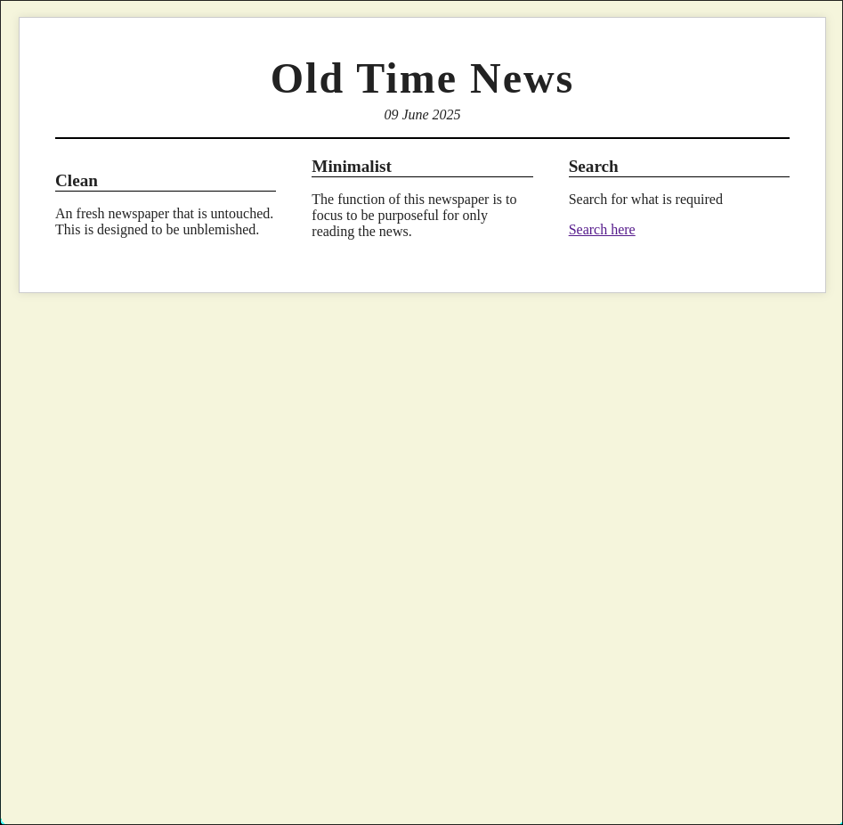
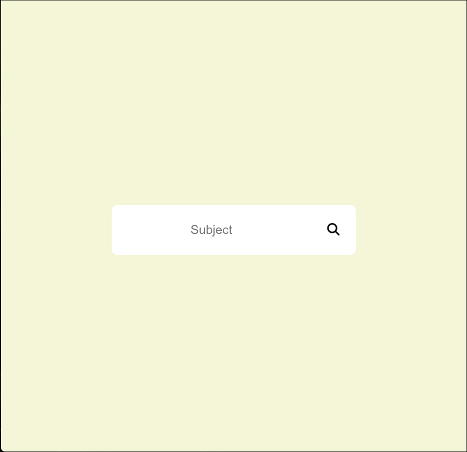

# OldTimeNews

**OldTimeNews** is a unique web application that transforms modern news into a nostalgic, old-style newspaper format. It offers a customizable reading experience, allowing users to select the domain from which their news originates.

-----

## ✨ Features

  * **Retro Newspaper Design:** Immerse yourself in news articles presented with classic fonts, layouts, and visual aesthetics reminiscent of early 20th-century newspapers.
  * **Customizable News Domains:** Tailor your news feed by specifying which domains you want to pull articles from, giving you control over your news sources.
  * **Dynamic News Content:** Powered by the [NewsAPI](https://newsapi.org/), the site delivers up-to-date headlines and stories from a vast array of sources.
  * **Integrated Search:** Easily find specific articles or topics of interest with the built-in search functionality.

-----

## 🚀 Getting Started

Follow these simple steps to get OldTimeNews up and running on your local machine.

### Prerequisites

  * **Python 3.x:** Ensure you have Python 3 installed on your system.
  * **NewsAPI Key:** You'll need to obtain a free API key from [NewsAPI.org](https://newsapi.org/) to fetch news content.

### Installation

1.  **Clone the Repository:**
    ```bash
    git clone https://github.com/BruceYoung19/OldTimeNews.git
    cd OldTimeNews
    ```
2.  **Install Dependencies:**
    Install all required Python packages using pip:
    ```bash
    pip install -r requirements.txt
    ```
3.  **Configure your NewsAPI Key:**
    Create a file named `.env` in the root directory of the project and add your NewsAPI key:
    ```
    NEWS_API_KEY=your_api_key_here
    ```
    *Replace `your_api_key_here` with your actual key from NewsAPI.org.*

### Running the Application

Once installed and configured, you can start the OldTimeNews application:

```bash
python app.py  # Or whatever your main application file is named
```

The application should then be accessible in your web browser, typically at `http://localhost:5000` (or similar, depending on your framework).

-----

## 📸 Screenshots

Get a glimpse of OldTimeNews in action:

<div>
  
  
</div>

-----

## 📜 Changelog

For a detailed history of updates, bug fixes, and new features, please refer to the [Changelog](https://github.com/BruceYoung19/OldTimeNews/blob/main/CHANGELOG.md).
